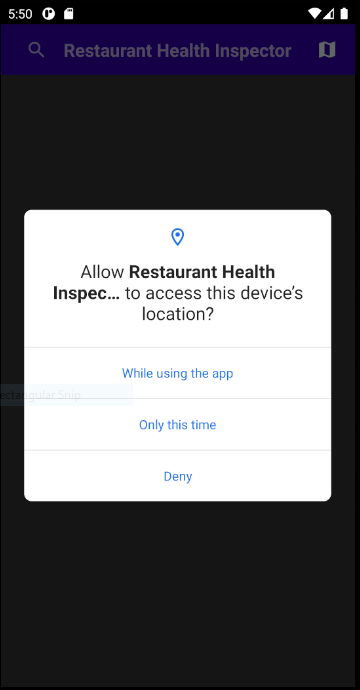
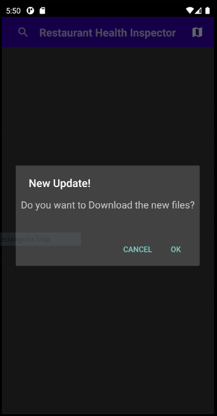
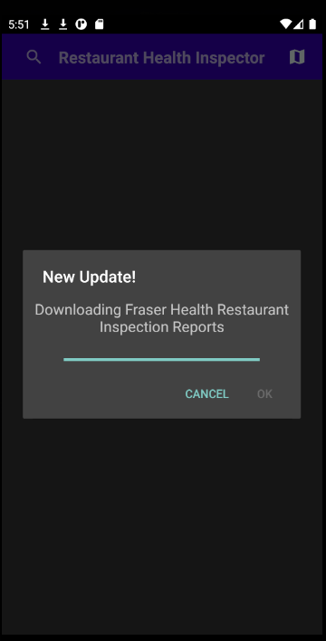
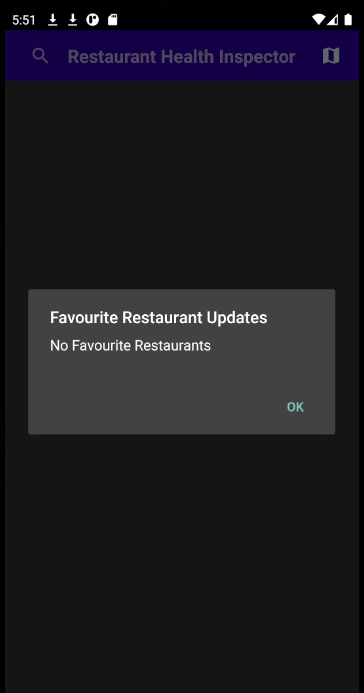
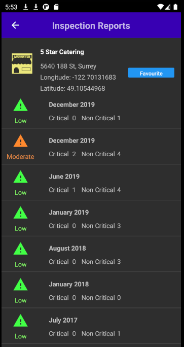
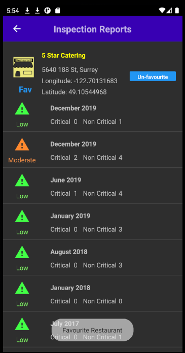
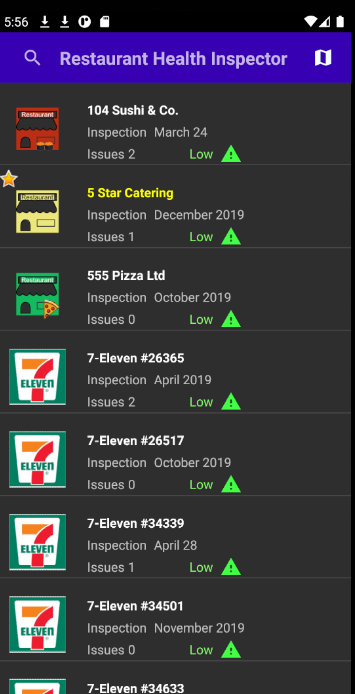
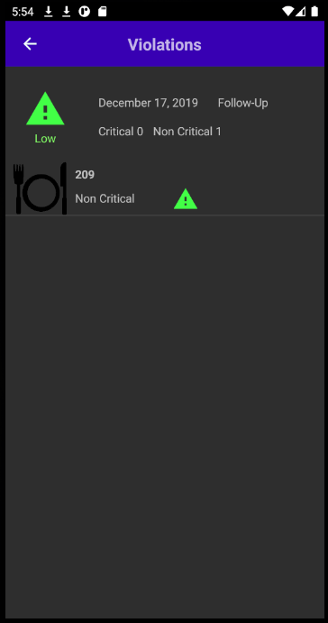
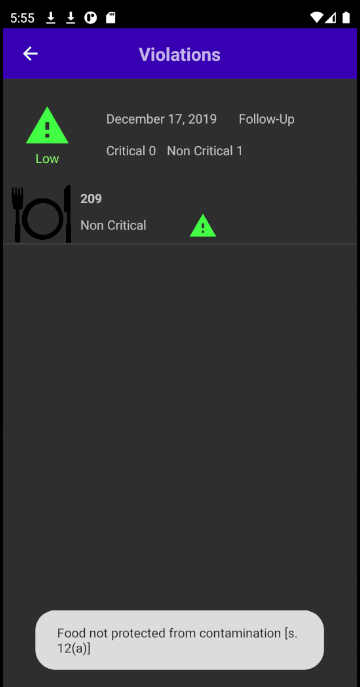
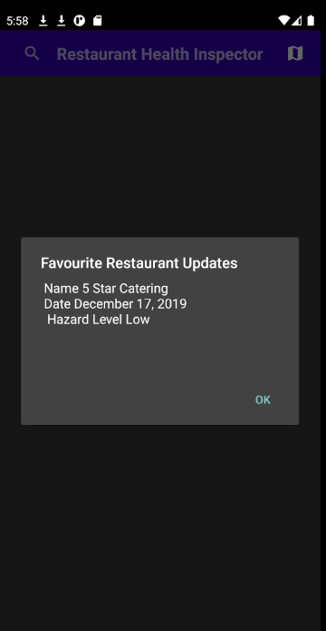

</p1>

# Restaurant Health Inspector
[]
[]

Restaurant Health Inspector is a an Android application, which get's inspection data from "Food facilities inspection reports and violation tickets" from the Surrey area. This data is kindly provided by Fraser Health.

The application is made in a way it is visible on all phone sizes, and displays the restaurants in alphabetical list order, as well as a map view. The users can also search keywords such as "pizza" or "sushi" or alternatively search by restaurant to see what inspections are found.

# Sample Output
                             
| Screenshot       | Explanation                                      
|---------------|----------------------|
|       | When the user first opens the application after installing, they'll be greeted with a message asking for permissions. Storage and Location information is needed to store data and use the map. If storage is rejected the app closes and sends a message to the user about the requirements, and information on how to turn on permissions                                                 
|  | AFterwards, the user is asked if they would like to install updated files. This appears every twenty hours or at the beginning of installation. If it's the user's first time getting this message, a default list of restaurants is shown, and if the user has already installed the application, and have previously said yes, the unupdated list of restaurants is shown. Otherwise the applications retrieves the up to date file from Fraser Health as shown in the next row.
|     | 
|     | Depending on if the user has already favourited restaurants, the most recent inspections will be shown. Otherwise a default message will be shown if no restaurants have been favourited.
|       | If the user has turned off their location, after accepting the permissions a list view of the restaurants will be shown, otherwise a map view of their current location will be shown. Map view/List view can be trigged by clicking the button on the top right. A user can also search the list by clicking the top left button
|         | Clicking a restaurant will give the user to favourite the restaurant and shows a list of inspections. If the user has favourited the restaurant, a star will be assigned to the icon, and there now will be an option to un-favourite. The pictures below show how a favourite restaurant is displayed
|     
|        | Clicking an inspection will lead to an activity which shows what type of visit occured when the inspection was, a brief error code and a corresponding image. Touching the error code or icon will show a longer description
|        | 
|        | After twenty hours, the user will be presented with an option to download additional files. If a user has favourited a restaurant, this informaton won't disappear and will appear if the user agrees to download the new updates.
